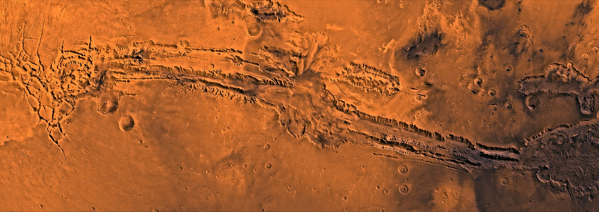
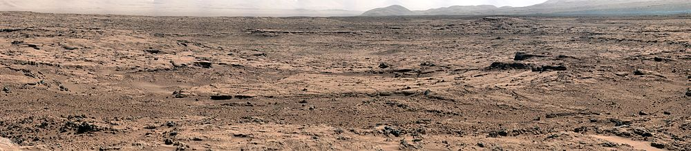

#<html>
<head>
  <link rel="apple-touch-icon" sizes="57x57" href="apple-icon-57x57.png">
<link rel="apple-touch-icon" sizes="60x60" href="apple-icon-60x60.png">
<link rel="apple-touch-icon" sizes="72x72" href="apple-icon-72x72.png">
<link rel="apple-touch-icon" sizes="76x76" href="apple-icon-76x76.png">
<link rel="apple-touch-icon" sizes="114x114" href="apple-icon-114x114.png">
<link rel="apple-touch-icon" sizes="120x120" href="apple-icon-120x120.png">
<link rel="apple-touch-icon" sizes="144x144" href="apple-icon-144x144.png">
<link rel="apple-touch-icon" sizes="152x152" href="apple-icon-152x152.png">
<link rel="apple-touch-icon" sizes="180x180" href="apple-icon-180x180.png">
<link rel="icon" type="image/png" sizes="192x192"  href="android-icon-192x192.png">
<link rel="icon" type="image/png" sizes="32x32" href="favicon-32x32.png">
<link rel="icon" type="image/png" sizes="96x96" href="favicon-96x96.png">
<link rel="icon" type="image/png" sizes="16x16" href="favicon-16x16.png">
<link rel="manifest" href="/manifest.json">
<meta name="msapplication-TileColor" content="#ffffff">
<meta name="msapplication-TileImage" content="ms-icon-144x144.png">
<meta name="theme-color" content="#ffffff">
    <meta charset="utf-8">
    <link href="styles/style.css" rel="stylesheet" type="text/css">
</head>
<body>
  <h1>
Планетная и солнечная системы
</h1>
  <h1>
Оглавление
</h1>
  <nav class="toc">
  <h2>Содержание:</h2>
  <h1>
  <ul>
    <ol>
    <li><a href="#theory">Теория и базовые понятия</a>
    <li><a href="#planet">Процесс образования планет и их спутников</a>
        <li><a href="#suns">Солнечная система</a>
          <li><a href="#sun">Солнце</a>
              <li><a href="#m">Меркурий</a>
                  <li><a href="#v">Венера</a>
                      <li><a href="#e">Земля</a>
                          <li><a href="#mr">Марс</a>
                            <li><a href="#u">Юпитер</a>
                                <li><a href="#s">Сатурн</a>
                                    <li><a href="#ur">Уран</a>
                                        <li><a href="#n">Нептун</a>

    
                                          
  </ul>
</nav>
<h1>
Предисловие
</h1>
 <h2>В 21 веке ведется огромное количество астрономических проектов с целью изучения космоса, но даже не смотря на большой масштаб этих работ, подобный рода контент не обсуждается в обществе, не разглашается в СМИ, и молодежь особо не заинтересована в этой теме.Но почему так происходит? Космос, по мнению многих ученых, самая невероятная часть нашего существования во все времена человечества; философы древнего мира уже в те времена задавались вопросом как устроена наша планета, и есть ли другие формы жизни по ту сторону галактики. В 20 веке же мировые страны СССР и США вели гонку вооружений, которая базировалась на скорейшем освоении космического пространства.</h2>
  
<b><h2>Цель:</b>

Информирование интересующихся астрономией. Подробно, но простым языком объяснить как планеты взаимосвязаны с другими космическими объектами и как образуются планетные системы в целом, чтобы заинтересовать других людей и дать базовые знания по этой теме.<h2>

    <h1 id="theory">
Теория и базовые понятия
</h1>
    <h2>Звёзды – это шары очень горячего газа, по размерам во много раз превышающие Землю.
В зависимости от температуры они могут светиться голубым, желтым или красным светом. Звезды так сильно удалены от нас, что представляются нам лишь светящимися точками. Звезды группируются в огромные массы, состоящие из многих миллионов звезд и называемые галактиками. Они бывают самых разных размеров.
 </h2>
      <h2>Плане́тная систе́ма — система звёзд и различных незвёздообразных астрономических объектов: планет и их спутников, карликовых планет и их спутников, астероидов, метеороидов, комет и космической пыли, которые обращаются вокруг общего центра масс. Несколько гравитационно связанных звёзд с замкнутыми орбитами и их планетные системы образуют звёздную систему.</h2>
    

    <h2>Очень логичная и стройная картина существовала до 90-х годов, однако именно в этот период было сделано несколько открытий, которые прямо или косвенно затрагивали наше представление об образовании планет: Планетные системы формируются из протопланетных дисков. Протопланетные диски изготовлены из пыли и льда, образующихся вокруг новых звезд. Со временем частицы в этих дисках начинают сжиматься вместе и образуют маленькие шарики материи, известные как планетезимали, первый этап эволюции планеты. Эти планетезимали привлекают больше материи своим гравитационным притяжением, пока не достигнут размера планет. Этот процесс образования объясняет, почему все планеты нашей Солнечной системы находятся в орбитальной плоскости. Планетная система, в которую входит Земля, вместе с Солнцем образует Солнечную систему.</h2>
            <h1 id="planet">
Процесс образования планет и их спутников
</h1>
        <h2>В настоящее время есть два подхода к образованию планетных систем. Один из них — это Гипотеза Оттто Юльевича Шмидта(1891 —1956). Он полагал, что миллиарды лет назад Солнце было окружено гигантским облаком, которое состояло из частичек холодной пыли и замёрзшего газа. Все они обращались вокруг Солнца. Находясь в постоянном движении, сталкиваясь, взаимно притягивая друг друга, они как бы слипались, образуя сгустки. Постепенно газово-пылевое облако сплющивалось, а сгустки стали двигаться по круговым орбитам. Со временем из этих сгустков и образовались планеты нашей Солнечной системы.

    </body>
    <html>
       <body style="background: url('bg.jpg') no-repeat fixed; -webkit-background-size: cover; background-size: cover;">
     <body>
  

    <h3,5>Сегодня учёные предполагают, что Солнце и планеты возникли одновременно из межзвёздного вещества — частиц пыли и газа. Это холодное вещество постепенно уплотнялось, сжималось, а затем распалось на несколько неравных сгустков. Один из них, самый большой, дал начало Солнцу. Его вещество, продолжая сжиматься, разогревалось. Вокруг него образовалось вращающееся газово-пылевое облако, которое имело форму диска. Из плотных сгустков этого облака возникли планеты, в том числе и наша Земля.</h3,5>
      

      <h3,5>Как видите, представления учёных о возникновении Земли, других планет и всей Солнечной системы менялись, развивались. Да и сейчас остаётся много неясного, спорного. Учёным предстоит разрешить немало вопросов, прежде чем мы достоверно узнаем, как возникла Земля.</h3,5>
          <h2 id="suns">
Солнечная система
</h2>
         <h3,5> Солнечная система — звёздная система в галактике Млечный Путь, включающая Солнце и естественные космические объекты, обращающиеся вокруг него: планеты, их спутники, карликовые планеты, астероиды, метеороиды, кометы и космическую пыль. Солнечная система состоит из центральной звезды Солнца и окружающих его множества небольших спутников - планет, астероидов (малых планет), комет, метеоритов и бесчисленных мелких метеорных частиц и пылинок.
</h3,5> 
         <h3,5>Солнце - самый большой объект в Солнечной Системе. Оно содержит более чем 99.8% от общей массы Солнечной Системы (Практически все оставшееся содержит Юпитер). Солнце выделяет энергию, которая создается за счет реакции ядерного синтеза. Каждую секунду тонны водорода перерабатываются в гелий, часть которого излучается в виде гамма-излучения. Пока это излучение движется к поверхности, энергия постоянно поглощается и переизлучается при все более и более нихких температурах. Так что к моменту достижения поверхности оно в основном оказывается видимым светом.</h3,5>
          

            <h3,5> Считая от Солнца, в состав солнечной системы входит восемь основных планет:</h3,5>
            <ul> 
              <li>Меркурий
                <li>Венера
                  <li>Земля
                    <li>Марс
                      <li>Юпитер
                        <li>Сатурн
                          <li>Уран
                            <li>Нептун
            </ul> 
               <h3,5> По своим физическим свойствам планеты делятся на земную группу и планеты-гиганты. Планеты земной группы относительно небольшие и плотные, состоят из металлов и минералов. К ним относятся:</h3,5>
               <ul> 
                 <li>Меркурий
                   <li>Венера
                     <li>Земля
                       <li>Марс
     </ul> 
       <figure class = "s">

<figcaption>Сравнительные размеры планет земной группы</figcaption></figure>
     <h3,5>Планеты-гиганты во много раз больше других планет, они состоят из газов и льда. Это:</h3,5>
       <ul> 
         <li>Юпитер
           <li>Сатурн
             <li>Уран
               <li>Нептун
                   </ul> 
                    <figure class = "s">

<figcaption>Сравнительные размеры планет-гигантов</figcaption></figure>
            <h2 id="sun">
Солнце
</h2>
   <h3,5>Солнце - рядовая звезда нашей Галактики. Солнце является самым знакомым всем людям астрономическим объектом. Это наша звезда, дающая нам жизнь. Из-за него днём все остальные космические объекты становятся невидимы. Солнце выделяет свет и тепло, до тех пор, пока не зайдёт за горизонт. И только потом небо становиться достаточно тёмным, чтоб увидеть остальные звёзды.</h3,5>
    
    <h3,5>Это массивный раскалённый газовый шар. Внутри его непрерывно происходит расщепление атомов водорода, переработка водорода в гелий. Этот процесс называется ядерной реакцией синтеза. При этом выделяется гигантское количество энергии.</h3,5>
 
  

  <h3,5>Солнце почти в 110 раз больше Земли, а его масса в тысячу раз превосходит массу всех планет, вместе взятых. Именно благодаря солнечному свету и теплу на Земле существует жизнь. </h3,5>
<h3,5> На самом деле как бы Солнце не казалось нам огромно, по сравнению с другими звёздами его размер скорее мал, чем велик. Среднее расстояние от Земли до Солнца 149,6 млн км. Это расстояние называют Астрономической единицей (ае). На поверхности Солнца имеются небольшие тёмные участки, которые называются солнечными пятнами.</h3,5>
 
<h3,5>Солнечные пятна – это тёмные образования, состоящие, как правило, из более тёмного дыра (тени) и окружающей его полутени. Совсем аленькие пятна называют порами. Время жизни пятен от нескольких часов до нескольких месяцев. Группы пятен всегда окружены факелами и флоккулами, протуберанцами, вблизи них иногда происходят солнечные вспышки, и в солнечной короне над ними наблюдаются образования в виде лучей шлемов, опахал - всё это вместе образует активную область на Солнце.</h3,5>
  <figure class = "s1">

<figcaption>Солнечные пятна</figcaption></figure>
  
 <h3,5> Солнечная корона – самая внешняя и наиболее разрежённая часть солнечной атмосферы, простирающаяся на несколько (более 10) солнечных радиусов. До 1931 года корону можно было наблюдать только во время полных солнечных затмений в виде серебристо-жемчужного сияния вокруг закрытого Луной диска Солнца. </h3,5>
 

 <h3,5> В короне хорошо выделяются детали её структуры: шлемы, опахала, корональные лучи и полярные щёточки. После изобретения коронографа солнечную корону стали наблюдать и вне затмений.</h3,5>
<h2 id="m">
Меркурий
</h2>
<h3,5> Меркурий ближайшая к Солнцу и восьмая по величине планета. лишь немного больше земной Луны. Это самая быстрая планета, вращающаяся вокруг Солнца каждые 88 земных дней.</h3,5>
 

<h3,5> Поверхность очень напоминает лунную: множество кратеров самых различных размеров. Наряду с кратерами (как правило, менее глубокими, чем на Луне) есть холмы и долины. Хорошо видны эскарпы - следы тектонической активности - крутые уступы длиной от 20 до 500 км и высотой 1-2 км. Происхождение эскарпов связывают со сжатием планеты в процессе ее остывания и приливным влиянием Солнца. По-видимому, эскарпы образовались раньше, чем кратеры меркурианской поверхности, так как они местами разрушены кратерами. </h3,5>
 
<h3,5> Интересно также, что, хотя ближайшими по расположению орбит к Земле являются Марс и Венера, Меркурий в среднем чаще других является ближайшей к Земле планетой (поскольку другие планеты отдаляются в большей степени, не будучи столь «привязанными» к Солнцу).</h3,5>
 
 
<h3,5> В связи с тем, что орбита Меркурия расположена столь близко к Солнцу, эта планета всегда появляется вблизи Солнца. Поэтому увидеть Меркурий можно только перед самим восходом или сразу после захода Солнца.</h3,5>
 
<figure class = "mercury">

<figcaption>Меркурий на фоне Солнца</figcaption></figure>
<h2 id="v">
Венера
</h2>
<h3,5> Венера - самая яркая на земном небосводе планета. Вторая от Солнца и шестая по величине планета. Орбита Венеры больше других планет приближена к круговой. Недоступна для оптических астрономических наблюдений, так как она плотно укутана атмосферой. Из-за такой плотной атмосферы на планете действует чрезвычайно мощный парниковый эффект, вследствие чего, температура поверхности Венеры поднимается от ожидаемых 400K до 740K (температура плавления свинца). Таким образом, на Венере жарче, чем на Меркурии, не смотря на то, что она находится почти вдвое дальше от Солнца. Это также первая планета, которую посетили космические аппараты («Маринер-2» в 1962 году), и на поверхность которой была совершена посадка («Венера-7» в 1970 году).</h3,5>
<figure class = "ven">

<figcaption>        орбита:    108,200,000.0 км (0.72 АЕ) от Солнца
        диаметр:        12,103.6 км
        масса:          4.869e24 кг</figcaption></figure>
<h3,5> Если размеры планеты близки к земным, то ее движение существенно отличается. Венера в 1,38 раза ближе к Солнцу, чем Земля, и продолжительность ее года составляет 224,7 земных суток.
  <h3,5>Венера классифицируется как землеподобная планета, и иногда её называют «сестрой Земли», потому что обе планеты похожи размерами и составом.  Однако условия на двух планетах очень разнятся. Атмосферное давление на поверхности Венеры в 92 раза больше, чем на Земле.</h3,5>
  
      <h3,5>Удивительно низкое число ударных кратеров говорит в пользу того, что поверхность Венеры относительно молода: ей приблизительно 500 миллионов лет. Тектоники плит на Венере нет (вероятно, потому, что её литосфера из-за отсутствия воды слишком вязкая и, следовательно, недостаточно подвижна), но есть много следов менее масштабных тектонических движений.</h3,5>
 
  
 <h3,5>На Венере отсутствует магнитное поле, возможно из-за ее медленного вращения.
У Венеры нет спутников и, таким образом, нет приливов.</h3,5>
 
 
<h3,5> Поскольку облака скрывают поверхность Венеры от визуальных наблюдений, её можно изучать только радиолокационными методами. Первые, довольно грубые, карты Венеры были составлены в 1960-е гг. на основе радиолокации, проводимой с Земли.</h3,5>
 
<h3,5> Венера интенсивно исследовалась советскими и американскими космическими аппаратами в 1960-х — 1980-х годах. Первым аппаратом, предназначавшимся для изучения Венеры, была советская «Венера-1», запущенная 12 февраля 1961 года; эта попытка оказалась неудачной.  в 1982 году «Венера-13» и «Венера-14» передали с поверхности Венеры цветные изображения. Впрочем, условия на поверхности Венеры таковы, что ни один из космических аппаратов не проработал на планете более двух часов.</h3,5>
  <figure class = "ven">

<figcaption>Фотография поверхности Венеры</figcaption></figure>
<h2 id="e">
Земля
</h2>
<h3,5> Земля является третьей планетой от Солнца и единственной в системе, где имеется жизнь. Небесное тело обладает большим количеством особенностей, и люди уже успели хорошо его изучить. Оно относится к планетам земной группы, наряду с Марсом, Венерой и Меркурием. Объект движется вокруг Солнца по определенной орбите и обладает уникальным климатом, благодаря которому существование жизни стало возможным.</h3,5>
<figure class = "v">

<figcaption>  орбита:   Земли удалена от Солнца на
                  149,600,000.0 км  (1.00 АЕ)
        диаметр:       12,756.3 км
        масса:       5.9736e24 кг
 
<h3,5> Землю, конечно, исследуют без помощи космических аппаратов. Но хорошо изучить Землю было невозможно вплоть до двадцатого века, потому что у ученых не было полной карты планеты. Изображения планеты, полученные из космоса, необычайно красивы и имеют огромное значение, например, они помогают составлять прогнозы погоды, прослеживать и предсказывать ураганы.</h3,5>
 
 
<h3,5> Земля состоит из нескольких слоев, имеющих различные химические и сеисмические свойства:</h3,5>
 

  <table border="1">
    <thead>
      <tr>
        <th>Слой</th>
        <th>Глубина(км)</th>
      </tr>
      <tbody>
        <tr>
          <td> Литосфера </td>
            <td>0—60</td>
        </tr>
        <tr>
            <td> Кора </td>
              <td>0—35</td>
        </tr>
        <tr>
            <td> Верхняя часть мантии </td>
              <td>35—60</td>
        </tr>
        <tr>
            <td> Мантия </td>
              <td>35—2890</td>
        </tr>
        <tr>
            <td> Астеносфера </td>
              <td>100—200</td>
        </tr>
        <tr>
          <td> Верхняя мезосфера (верхняя мантия) </td>
            <td>35—660</td>
        </tr>
        <tr>
          <td> Нижняя мезосфера (нижняя мантия) </td>
            <td>660—2890</td>
        </tr>
        <tr>
          <td> Внешнее ядро </td>
            <td>2890—5150</td>
        </tr>
        <tr>
          <td> Внутреннее ядро </td>
            <td>5150—6371</td>
        </tr>
        </table>
        <tfoot>

<h3,5>За миллиарды лет существования Земли установилось равновесие, при котором Земля излучает в космос то же количество энергии, что и получает от Солнца, но в основном в инфракрасном (тепловом) диапазоне длин волн. </h3,5>
<h3,5>
Магнитное поле
</h3,5>
<h3,5> Земля непрерывно вращается вокруг своей оси. Ядро, находящееся внутри планеты, реагирует на это, из-за чего вокруг нее возникает магнитное поле, называемое “магнитосферой”.</h3,5>
 
<h3,5> Почему у Земли есть магнитное поле? За счет проводимости расплавленной плазмы в земном ядре магнитное поле Земли должно было исчезнуть за несколько тысяч лет. Однако у нашей Земли, возраст которой пять миллиардов лет, все еще существует сильное магнитное поле. Эта загадка до сих пор не раскрыта, но в последнее время считают, что магнитное поле объясняется движениями во внешней жидкой оболочке ядра. А именно, по мере того как внешняя оболочка ядра охлаждается и части ее падают внутрь, океаны магмы, богатой железом, поднимаются вверх в спиральном движении под действием вращения Земли. Геологи полагают, что именно это движение поддерживает земной магнетизм. На рисунке показаны результаты компьютерного моделирования магнитного поля Земли, чьи силовые линии доходят до двух земных радиусов. Голубым цветом показаны линии, направленные внутрь, желтым - наружу.</h3,5>
 

<h3,5>
Особенности Земли
</h3,5>
<h3,5> Из космоса атмосфера Земли выглядит как очень тонкая голубая кайма вокруг планеты. Эта тонкая оболочка состоит из азота (77,6%) и кислорода (20,7%). Остальное представляет собой смесь других газов. В земной атмосфере кислорода гораздо больше, чем в атмосфере любой другой планеты. Этот газ жизненно важен для растений и животных.</h3,5>
 
<h3,5> Определенная часть солнечного излучения вредна для живых организмов Земли. Слой газа озона действует как фильтр, задерживающий самые вредные лучи. Однако ученые установили, что некоторые промышленные газы, хлорфторкарбоны, повреждают озоновый слой, образуя в нем дыры, особенно над полюсами Земли. Если опасный процесс разрастания этих дыр не остановить, в ближайшее время это может привести к росту раковых заболеваний, поскольку живые клетки подвергнутся усиливающемуся воздействию радиации.</h3,5>
<h2 id="mr">
Марс
</h2>
<h3,5>Марс — четвертая от Солнца большая планета Солнечной системы — меньше Земли почти в два раза. Долгое время считалось, что на красной планете существует жизнь. Однако многочисленные исследовательские миссии пока не подтвердили наличие какой-либо жизни на поверхности планеты.</h3,5>
 
  <h3,5>Марс обладает очень тонкой атмосферой состоящей в основном из оставшегося несвязанным углекислого газа (95.3%), азота (2.7%), аргона (1.6%) и следов кислорода (0.15%) и воды (0.03%).</h3,5>
 
<figure class = "v">

<figcaption> орбита:    227,940,000 км (1.52 ае) от Солнца
        диаметр:         6,794 км
        масса:       6.4219e23 кг
         
<h3,5> Несмотря на то, что Марс гораздо меньше Земли, площадь его поверхности примерно равна площади суши на Земле. Рельеф поверхности Марса более разнообразен и богат интересными особенностями, чем поверхность любой из планет земной группы (может быть за исключением самой Земли). Некоторые образования на его поверхности особенно грандиозны:</h3,5>
 
<ul> 
  <li> Гора Олимп (Olympus Mons): самая большая гора в Солнечной Системе высотой 24 км (78,000 футов) от подножия.
    <li>Тарсис (Tharsis): огромная возвышенность на поверхности Марса около 4000 км в поперечнике и 10 км высотой.
      <li>Долины Маринеров (Valles Marineris): система каньонов протяженностью 4000 км и от 2 до 7 км глубиной
        <li>Hellas Planitia: огромный кратер в южном полушарии около 6 км глубиной и 2000 км в диаметре.
          </ul>
          <h3,5> Большая часть Марсианской поверхности очень стара, и изрыта кратерами, но на ней есть много молодых провалов, горные хребтов, холмов и долин.</h3,5>
            <h3,5> Марс (Как Меркурий, и Луна) в настоящее время не проявляет тектонической активности. Из-за отсутствия движения тектонических плит, горячие точки под корой остались в фиксированном положении относительно поверхности. Это, вместе со слабой поверхностной гравитацией, может быть причиной возникновения возвышенности Tharis и ее громадных вулканов. Однако, на сегодняшний день признаков вулканической активности нет. </h3,5>
          

          <h3,5>Южное полушарие Марса это в основном старые изрытые кратерами нагорья подобные Лунным. В противоположность этому, большая часть северного полушария состоит из гораздо более молодых и более низких равнин с более сложной геологической историей.  На их границах встречаются резкие перепады высот до нескольких километров величиной. Причины таких глобальных различий и резких границ неизвестны. </h3,5>
             
              <h3,5> Несколько фотографий поверхности:</h3,5>
              

                

                  

      <h2 id="u">
Юпитер
</h2>
<h3,5> Самая крупная, пятая от Солнца, большая планета Солнечной системы </h3,5>
<figure class = "v">

<figcaption>  орбита:    778,330,000 км (5.20 АЕ) от Солнца
        диаметр:       142,984 км (экваториальный)
        масса:        1.900e27 кг</figcaption></figure>
 
<h3,5> Ряд атмосферных явлений на Юпитере: штормы, молнии, полярные сияния — имеет масштабы, на порядки превосходящие земные. Примечательным образованием в атмосфере является Большое красное пятно — гигантский шторм, известный с XVII века. Юпитер — крупнейшая планета Солнечной системы, пятая по удалённости от Солнца. Наряду с Сатурном, Ураном и Нептуном, Юпитер классифицируется как газовый гигант.</h3,5>
 
 
<h3,5> У газовых гигантов нет твердой поверхности, газ из которого они состоят просто становится плотнее с глубиной (радиусы и диаметры для этих планет отсчитывается от уровня "поверхности", соответствующего давлению в 1 атмосферу). То что мы принимаем за поверхность, когда смотрим на эти планеты, оказывается вершинами облаков в верхних слоях их атмосфер (слегка выше уровень, где давление равно одной атмосфере).</h3,5>
 
 
<h3,5> На Юпитере, по-видимому, существуют три слоя облаков различно природы -- состоящих из аммиачного льда, гидросульфита аммония и из смеси льда и воды. Однако, предварительные результаты зонда Галилео дают неполную об облачном слое (один из приборов видит самые верхние слои, в то время как другой может регистрировать следующий). </h3,5>
 
 
<h3,5>Данные атмосферного зонда Галилео также показали, что там гораздо меньше воды, чем считалось ранее. Предполагалось, что атмосфера Юпитера должна состоять вдвое больше кислорода (из которого при реакции с водородом получается вода), чем Солнце. Но теперь ясно, что на самом деле концентрация кислорода гораздо ниже, чем на Солнце. Сюрпризом также оказались высокая температура и плотность верхних слоев Юпитерианской атмосферы.</h3,5>
 
    

<h3,5> На данный момент наибольшее признание получила следующая модель внутреннего строения Юпитера:</h3,5>
<ul> 
    <li>внешний слой, состоящий из водорода;
        <li>средний слой, состоящий из водорода (90 %) и гелия (10 %);
  <li>нижний слой, состоящий из водорода, гелия и примесей аммиака, гидросульфида аммония и воды, образующих три слоя облаков;
      <li>Слой металлического водорода.
      <li> Каменное ядро.
  </ul>
    

<h3,5>
О красном пятне
</h3,5>
<h3,5> Большое красное пятно — овальное образование изменяющихся размеров, расположенное в южной тропической зоне. Это уникальный долгоживущий гигантский ураган, вещество в котором вращается против часовой стрелки и совершает полный оборот за 6 земных суток. Скорость вращения Большого красного пятна составляет 360 км/ч</h3,5>
 
<h3,5> Красный цвет Большого красного пятна представляет собой загадку. Одной из возможных причин могут быть химические соединения, содержащие фосфор. Цвета и механизмы, создающие вид всей юпитерианской атмосферы, до сих пор ещё плохо поняты и могут быть объяснены только при прямых измерениях её параметров.</h3,5>
<figure class = "v">

<figcaption>Большое красное пятно крупным планом</figcaption></figure>
    <h2 id="s">
Сатурн
</h2>
    <h3,5> Шестая планета от Солнца. Как и спутники Юпитера, Сатурн был обнаружен Галилеем в начале XVII века. Вторая по размерам планета в Солнечной системе после Юпитера. Сатурн, а также Юпитер, Уран и Нептун, классифицируются как газовые планеты-гиганты. На сегодняшний день эта планета остаётся одной из наименее изученных. </h3,5>
    <figure class = "v">

<figcaption>орбита:    1,429,400,000 км (9.54 а.е.) от Солнца
        диаметр:         120,536 км (экваториальный)
        масса:           5.68e26 кг </figcaption></figure>
         
  <h3,5>Сатурн обладает заметной системой колец, состоящей главным образом из частичек льда, меньшего количества тяжёлых элементов и пыли. Вокруг планеты обращается 82 известных на данный момент спутника. Титан — самый крупный из них, а также второй по размерам спутник в Солнечной системе (после спутника Юпитера, Ганимеда), который превосходит по своим размерам Меркурий и обладает единственной среди спутников планет Солнечной системы плотной атмосферой.</h3,5>
       
<h3,5> Внутреннее строение Сатурна подобно строению Юпитера. Планета состоит из твердого ядра, окруженного слоем жидкого металлического водорода, а снаружи - слоем молекулярного водорода. Там также присутствуют следы различных льдов.</h3,5>
 
<h3,5> Внешний вид планеты, в видимом свете, выглядит более спокойным, чем у Юпитера. Планета имеет полосы облаков в атмосфере, но они бледно-оранжевые и слабо заметны. Оранжевый цвет обусловлен соединениями серы в его атмосфере. На различных длинах волн света, а также на улучшенных изображениях Кассини, атмосфера выглядит гораздо более впечатляющей и бурной.</h3,5>
   
  

 
<h3,5> Полосы, так заметные на Юпитере, на Сатурне гораздо слабее. Они так гораздо шире вблизи экватора. На Сатурне также обнаружены долгоживущие овалы (красное пятно в центре изображения) и другие особенности известные на Юпитере.</h3,5>
   
  

  <h3,5> Сегодня известно, что у всех четырёх газообразных гигантов есть кольца, но у Сатурна они самые заметные. Существует три основных кольца и четвёртое — более тонкое. Все вместе они отражают больше света, чем диск самого Сатурна. </h3,5>
   
  <h3,5> Три основных кольца принято обозначать первыми буквами латинского алфавита. Кольцо В — центральное, самое широкое и яркое, оно отделяется от внешнего кольца А щелью Кассини шириной почти 4000 км, в которой находятся тончайшие, почти прозрачные кольца. Внутри кольца А есть тонкая щель, которая называется разделительной полосой Энке. Кольцо С, находящееся ещё ближе к планете, чем В, почти прозрачно.</h3,5>
   
 
  <h3,5> Одно из самых странных погодных явлений когда-либо обнаруженное это так называемый северный шестиугольный шторм. Шестиугольник вращается с точно такой же скоростью, как и сама планета. Однако Северный полюс планеты отличается от Южного полюса, в центре которого имеется огромный ураган с гигантской воронкой.</h3,5>
   
  

</html>
